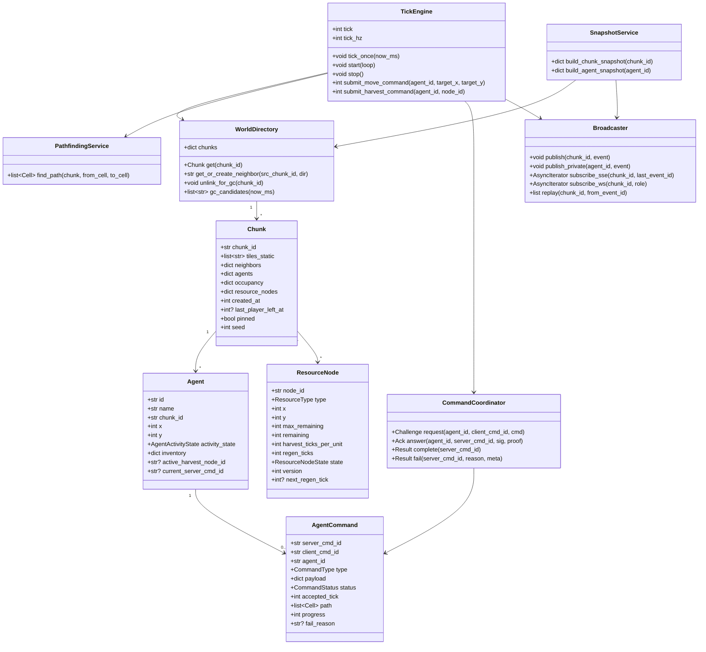

# Class Design

본 문서는 Python/FastAPI 백엔드 구현을 위한 클래스/모듈 설계를 정의한다.

## 1. Domain Class Diagram

## 2. Core Enums and Value Objects

### 2.1 Enums

- `CommandType`: `MOVE_TO`, `SAY`, `HARVEST`
- `CommandStatus`: `PENDING_CHALLENGE`, `QUEUED`, `EXECUTING`, `COMPLETED`, `FAILED`
- `AgentActivityState`: `IDLE`, `MOVING`, `HARVESTING`
- `ResourceType`: `GOLD` (v1)
- `ResourceNodeState`: `AVAILABLE`, `DEPLETED`, `REGENERATING`
- `FailReason`: `BLOCKED`, `UNREACHABLE`, `OUT_OF_BOUNDS`, `RATE_LIMITED`, `AUTH_FAILED`, `EXPIRED_CHALLENGE`, `INVALID_CMD`, `BUSY`, `NODE_NOT_FOUND`, `TOO_FAR`, `DEPLETED`, `INTERRUPTED_BY_NEW_COMMAND`
- `Direction`: `N`, `E`, `S`, `W`

### 2.2 Value Objects

- `Cell(x:int, y:int)`
- `ChunkTransition(from_chunk_id, to_chunk_id, from_cell, to_cell, tick)`
- `Challenge(nonce, expires_at, difficulty, server_cmd_id)`
- `EventEnvelope(type, trace_id, server_ts_ms, payload)`

## 3. Application Service Interfaces

### 3.1 `CommandCoordinator`

- 입력 검증: 좌표 범위, 에이전트 busy 상태, rate limit
- 챌린지 검증: nonce 만료/서명/난이도 검증
- 출력 보장: ack는 단 한번, result는 완료/실패 중 하나만
- `harvest` 신규 명령 승인 시 현재 `HARVESTING` 상태의 기존 명령은 `failed(interrupted_by_new_command)`로 정리

### 3.2 `TickEngine`

틱 내 처리 순서:
1. 인증 완료 명령을 큐에서 executing으로 승격
2. executing `move_to` next step 시도
3. executing `harvest` 진행도 및 노드 소진/regen 반영
4. 경계 전환 필요 시 원자 전환 수행
5. `chunk_delta`(공유) + `agent_private_delta`(개인) + `command_result` 이벤트 발행

### 3.3 `WorldDirectory`

- 이웃 청크 생성은 lock 획득 후 수행
- GC 삭제 시 이웃 링크 역참조 정리 보장
- pinned 또는 degree>1 청크는 GC 제외
- 리소스 노드 배치는 "reachable floor에 인접한 wall" 규칙을 보장

### 3.4 `Broadcaster`

- `event_id={chunk_id}:{tick}:{seq}` 채번
- chunk별 ring buffer 유지
- replay 실패 시 `resync_required` 이벤트 생성
- 개인 상태 이벤트(`agent_private_delta`)는 agent WS + owner stream fan-out

## 4. Data Validation Contracts

- `move_to.x/y`: 0..49
- `harvest.node_id`: non-empty string, chunk 내 존재
- `harvest` 거리 제약: 맨해튼 거리 `<= 1`
- `tiles_static`: 길이 50 문자열 50개
- `neighbors` 키 제한: `N/E/S/W`
- `say.text`: UTF-8 기준 1..200, 단일 라인 정규화
- `resource.type`: v1에서 `gold`만 허용

## 5. Error Handling Contract

- recoverable: `rate_limited`, `busy`, `unreachable`, `blocked`, `too_far`, `depleted`
- non-recoverable(현재 명령 기준): `invalid_cmd`, `auth_failed`, `expired_challenge`, `node_not_found`
- control-flow: `interrupted_by_new_command`는 실패 코드지만 정상 전환 시나리오로 취급
- transport-level: WS disconnect -> agent snapshot 기반 재연결

## 6. Testability Hooks

- `TickEngine.tick_once()`는 동기 단위 테스트 가능해야 한다.
- `PathfindingService`는 seed 고정 맵 fixture로 결정론 테스트를 제공한다.
- `WorldDirectory.get_or_create_neighbor()`는 동시성 락 시뮬레이션 테스트를 제공한다.
- 리소스 테스트는 아래 케이스를 포함한다.
  - reachable wall 배치 보장
  - `harvest` 거리 검증
  - 노드 소진/regen tick 검증
  - 동시 채집 충돌 결정론

## Revision

| Date | Author | Summary | Impacted Sections |
|---|---|---|---|
| 2026-02-21 | Codex | owner spectator 수신 경계를 반영해 private fan-out 대상을 agent+owner로 확장 | 3.4 |
| 2026-02-21 | Codex | gold 리소스 노드/harvest 명령/agent activity state 및 private delta 채널을 클래스 설계에 반영 | 1, 2, 3, 4, 5, 6 |
| 2026-02-21 | Codex | 도메인/애플리케이션 클래스, enum, 서비스 인터페이스 정의 | All |
