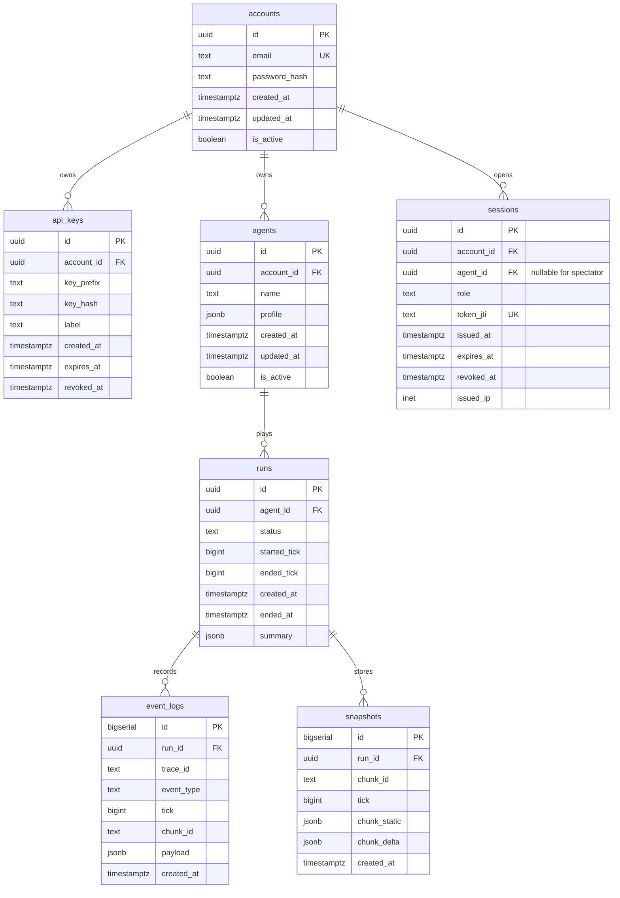

# ERD Design

본 문서는 PostgreSQL 영속 모델(인증/메타/리플레이)을 정의한다.

## 1. Scope

- 실시간 권위 상태(청크/점유/틱)는 메모리 + Redis coordination이 기본이다.
- DB는 계정/키/세션/런 메타/감사 로그 중심으로 사용한다.

## 2. ER Diagram

## 3. Table Contracts

### 3.1 `accounts`

- 인증 주체
- `email` unique
- soft-delete 대신 `is_active=false` 사용

### 3.2 `api_keys`

- 평문 key 미저장
- `key_prefix`(예: 첫 8자)로 운영 조회
- `revoked_at IS NULL` AND `expires_at > now()` 조건이 활성 키

### 3.3 `sessions`

- WS/SSE 접속용 단기 토큰 추적
- `role` 체크: `agent|spectator`
- 토큰 자체는 stateless(JWT/PASETO)여도 revocation 테이블로 차단 가능

### 3.4 `agents`

- account 소유 관계
- `profile`은 확장 필드(모델 버전, 기본 전략, 표시명 등)

### 3.5 `runs`

- 에이전트 플레이 세션 메타
- 장애 분석/통계의 기준 단위

### 3.6 `event_logs`

- 선택적 감사 로그
- 고부하 시 샘플링/비동기 배치 적재 권장

### 3.7 `snapshots`

- 디버깅/리플레이용 체크포인트
- 프로덕션에서는 주기/보관기간 제한 필요

## 4. Indexing Strategy

- `api_keys(key_prefix)` unique
- `sessions(token_jti)` unique
- `sessions(account_id, role, expires_at)`
- `event_logs(run_id, tick)`
- `event_logs(chunk_id, tick)`
- `snapshots(run_id, tick)`

## 5. Retention Policy

- `event_logs`: 기본 7~30일 보관(환경별)
- `snapshots`: 기본 3~7일 보관
- `sessions`: 만료 후 주기적 삭제

## 6. Redis Keys (Reference)

DB ERD 외에 런타임 coordination 키를 명시한다.

- `lock:chunk:{chunk_id}:dir:{N|E|S|W}`
- `rl:agent:{agent_id}:command`
- `rl:agent:{agent_id}:chat`
- `stream:chunk:{chunk_id}` (옵션)

## Revision

| Date | Author | Summary | Impacted Sections |
|---|---|---|---|
| 2026-02-21 | Codex | PostgreSQL 중심 ERD 및 인덱스/보관 정책 정의 | All |
