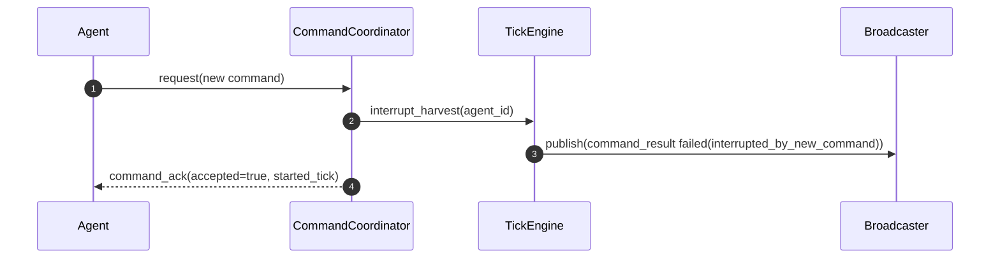
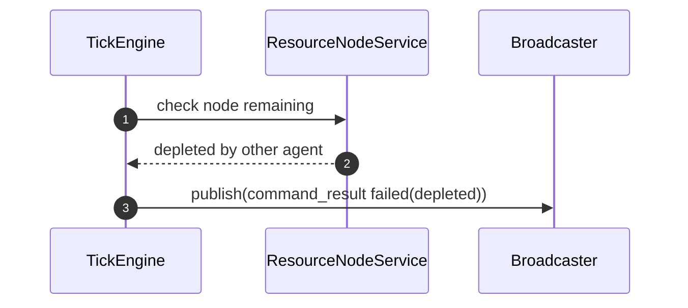
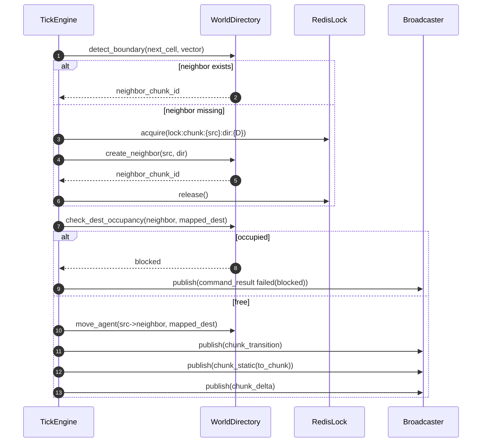
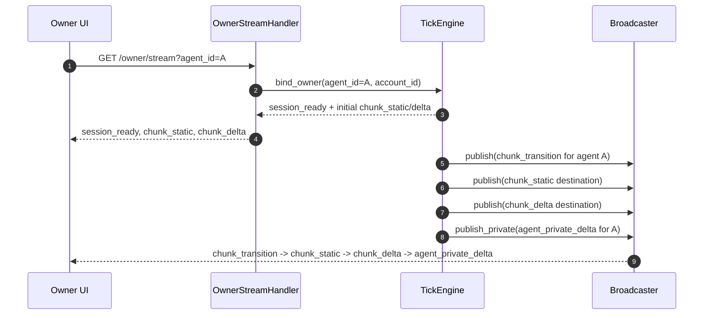
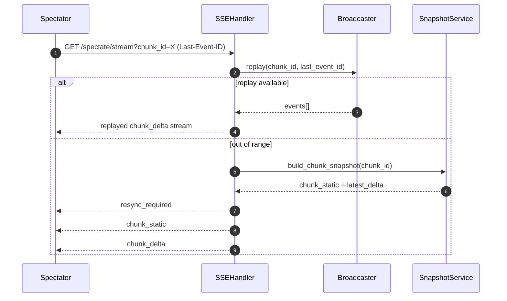
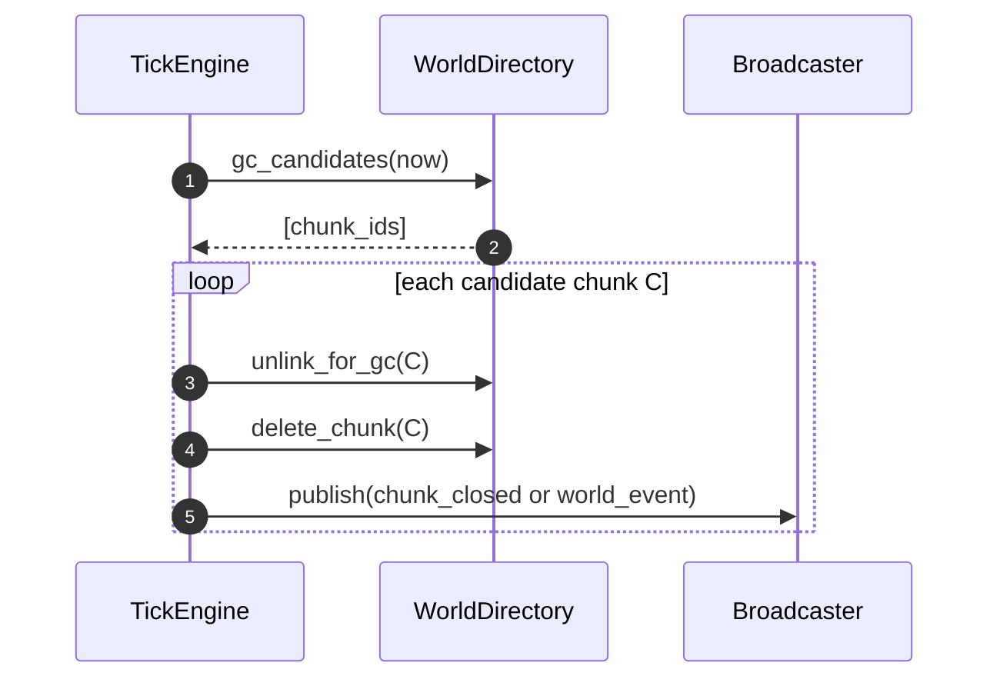

# Sequence Design

본 문서는 핵심 런타임 시퀀스를 정의한다.

## 1. Agent Command Handshake


## 2. move_to Execution and Blocked Failure

```mermaid
sequenceDiagram
    autonumber
    participant Tick as TickEngine
    participant WD as WorldDirectory
    participant PF as PathfindingService
    participant BC as Broadcaster

    Tick->>PF: find_path(chunk, from, target)
    PF-->>Tick: path[]
    loop each tick
        Tick->>WD: try_occupy(next_cell)
        alt occupied or blocked tile
            WD-->>Tick: fail
            Tick->>BC: publish(command_result failed(blocked))
            Tick->>BC: publish(chunk_delta blocked_event)
            break
        else success
            WD-->>Tick: moved
            Tick->>BC: publish(chunk_delta position_update)
        end
    end
```

## 3. Harvest Execution (Gold, Shared + Private)

```mermaid
sequenceDiagram
    autonumber
    participant Tick as TickEngine
    participant RS as ResourceNodeService
    participant BC as Broadcaster

    Tick->>RS: validate(node_id, range<=1, available)
    RS-->>Tick: ok

    loop every tick
        Tick->>RS: progress_harvest(agent_id, node_id)
        RS-->>Tick: mined?(amount=1 or 0), remaining
        alt mined amount=1
            Tick->>BC: publish(chunk_delta resource_harvest + remaining)
            Tick->>BC: publish_private(agent_private_delta inventory.gold+1)
        end
        alt remaining == 0
            Tick->>BC: publish(chunk_delta resource_depleted)
            Tick->>BC: publish(command_result completed(node_depleted))
            break
        end
    end
```

## 4. Harvest Forced End by New Command



## 5. Harvest Forced End by External Depletion



## 6. Boundary Transition (Atomic)



## 7. Owner Stream Auto-follow



## 8. Spectator SSE Replay/Resync



## 9. Chunk GC



## 10. Failure/Retry Notes

- `busy`, `rate_limited`, `unreachable`, `too_far`는 즉시 재시도하지 않고 agent 전략 루프에서 backoff를 적용한다.
- `blocked`, `depleted`는 재탐색/재선택 트리거 이벤트로 간주한다.
- `interrupted_by_new_command`는 오류가 아니라 정상 제어 흐름 중단 코드로 취급한다.
- SSE 재연결 시 replay 실패가 반복되면 snapshot 기반 리싱크를 강제한다.

## Revision

| Date | Author | Summary | Impacted Sections |
|---|---|---|---|
| 2026-02-21 | Codex | Owner stream 자동 추적 시퀀스(`chunk_transition -> chunk_static -> chunk_delta`)를 추가 | 7, 10 |
| 2026-02-21 | Codex | harvest 실행/중단/외부 소진 종료 시퀀스와 private delta 발행 흐름을 추가 | 1, 3, 4, 5, 10 |
| 2026-02-21 | Codex | 핵심 런타임 시퀀스(핸드셰이크/실행/전환/replay/GC) 상세화 | All |
