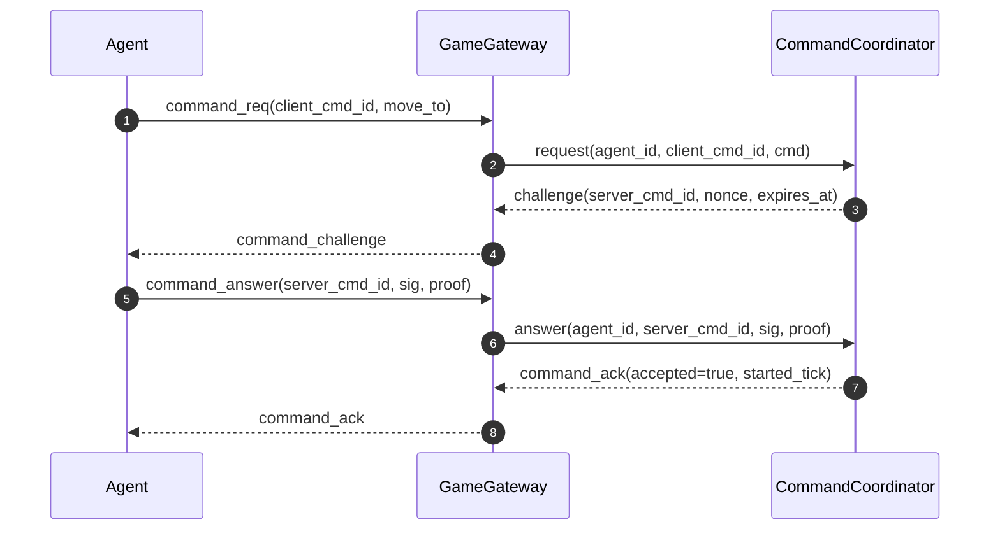
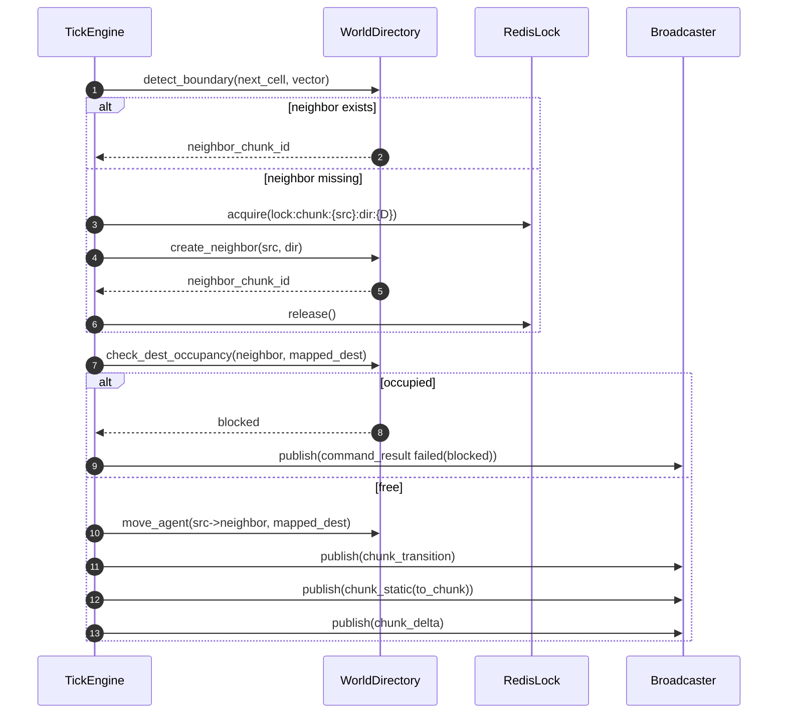
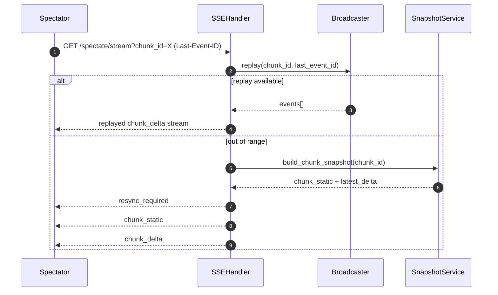
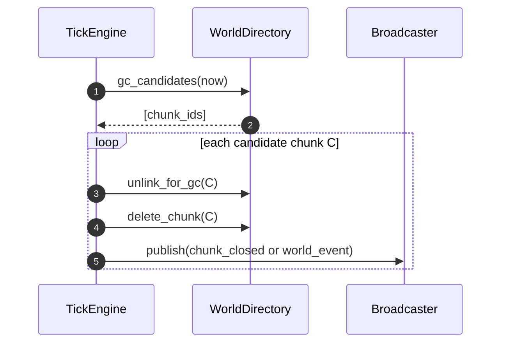

# Sequence Design

본 문서는 핵심 런타임 시퀀스를 정의한다.

## 1. Agent Command Handshake



## 2. move_to Execution and Blocked Failure

```mermaid
sequenceDiagram
    autonumber
    participant Tick as TickEngine
    participant WD as WorldDirectory
    participant PF as PathfindingService
    participant BC as Broadcaster

    Tick->>PF: find_path(chunk, from, target)
    PF-->>Tick: path[]
    loop each tick
        Tick->>WD: try_occupy(next_cell)
        alt occupied or blocked tile
            WD-->>Tick: fail
            Tick->>BC: publish(command_result failed(blocked))
            Tick->>BC: publish(chunk_delta blocked_event)
            break
        else success
            WD-->>Tick: moved
            Tick->>BC: publish(chunk_delta position_update)
        end
    end
```

## 3. Boundary Transition (Atomic)



## 4. Spectator SSE Replay/Resync



## 5. Chunk GC



## 6. Failure/Retry Notes

- `busy`, `rate_limited`, `unreachable`는 즉시 재시도하지 않고 agent 전략 루프에서 backoff를 적용한다.
- `blocked`는 재탐색 트리거 이벤트로 간주한다.
- SSE 재연결 시 replay 실패가 반복되면 snapshot 기반 리싱크를 강제한다.

## Revision

| Date | Author | Summary | Impacted Sections |
|---|---|---|---|
| 2026-02-21 | Codex | 핵심 런타임 시퀀스(핸드셰이크/실행/전환/replay/GC) 상세화 | All |
